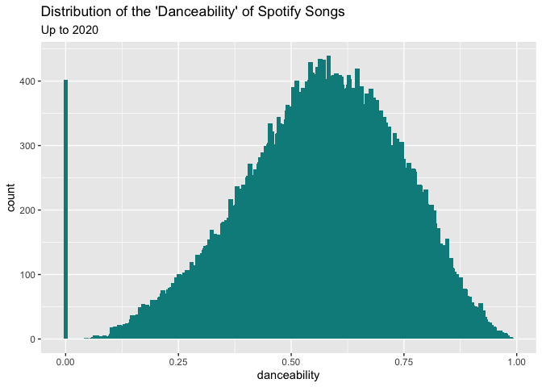

Proposal for STA 418/518
================
Ian Curtis, Stacy Keydel, Sarba Uprety

## What are you doing?

We would like to create an interactive Shiny app from Spotify data. This
would allow users to search artists and display various statistics about
that artist’s music. These are provided in our data set and include
features such as “danceability”, “liveness”, “acousticness” and
“energy”. If possible, we would like to add a feature to compare two
artists side by side and maybe even connect to the API to provide the
30-second samples of the artist’s popular songs.

## Why are you doing it?

Listening to music on streaming platforms is extremely popular. Also,
music is entertaining many people, regardless of background can create
emotional connections from songs. Furthermore, a searchable app such as
this one does not yet exist and we will be contributing to the knowledge
of music.

## How are you doing it?

We will start by using R and the `{tidyverse}` to do an exploratory data
analysis and clean the data for ease of use later. Part of this original
analysis will be cleaning up outliers and creating basic graphs and/or
tables. We then will learn how to use Shiny apps and incorporate the
data into our own (that can be searched and display graphs).

``` r
library(tidyverse)
spotify <- read_csv(here::here("original_data/chunks1-50.csv"))
```

``` r
# Example Plot
spotify %>% 
  ggplot(aes(x = danceability)) +
    geom_bar(width=.01, fill = "cyan4") +
    labs(
      title = "Distribution of the 'Danceability' of Spotify Songs",
      subtitle = "Up to 2020"
    )
```

<!-- -->

## How will you know you are successful?

We will know we are on the way when we get the first draft of the app
running without errors. When the app is fully functional, searches work,
and graphs display correctly, we will know that we have succeeded in our
goals.
